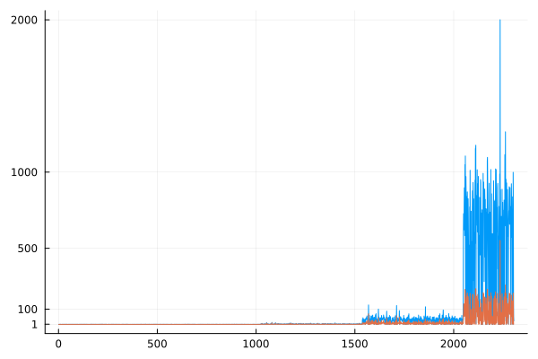
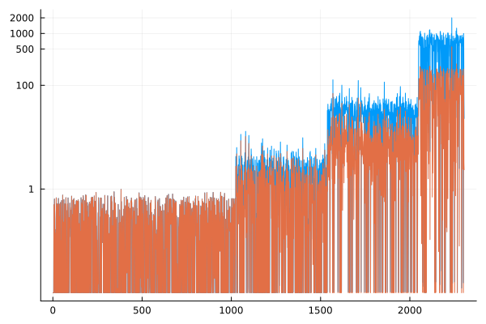

# Compression and bound tightening performance in a large neural network

**Model:** *Adadelta* $l_1=0.001$ $l_2=0.001$ *(from Vilhelm's thesis)*

**Neurons:** *2 - 1024 - 512 - 512 - 256 - 1*

## Computational performance

### LRR bound tightening *(Grimstad and Andresson)*
Only considers the previous layer bounds and the weights.

`0.626957 seconds (23.18 M allocations: 634.177 MiB, 11.46% gc time)`

### Compression with LRR bounds
`0.219787 seconds (3.68 M allocations: 156.574 MiB, 7.72% gc time)`

### LP bound tightening
Linear relaxation of the standard bound tightening.

`(25 minutes on Vilhelm's computer)`

### Compression with LP bounds
`0.474099 seconds (3.68 M allocations: 312.358 MiB, 5.48% gc time)`

It cannot be seen from this data but the input domain can significantly affect the performance of the bound tightening.

### Comparison of the upper bounds
LP bounds shown in <span style="color:tomato">red</span> and LRR bounds in <span style="color:lightblue">blue</span>.




The bounds get progressively worse with the deeper layers. First layer bounds are very similar but there is about a five-fold difference for the last layers.

## Model compression

`model` is the original. `compressed_loose` corresponds to the model compressed with LRR bounds. `compressed` corresponds to the the model compressed with LP bounds.

```julia
julia> model
Chain(
  Dense(2 => 1024, relu),               # 3_072 parameters
  Dense(1024 => 512, relu),             # 524_800 parameters
  Dense(512 => 512, relu),              # 262_656 parameters
  Dense(512 => 256, relu),              # 131_328 parameters
  Dense(256 => 1),                      # 257 parameters
)                   # Total: 10 arrays, 922_113 parameters, 7.036 MiB.

julia> compressed_loose
Chain(
  Dense(2 => 132, relu),                # 396 parameters
  Dense(132 => 439, relu),              # 58_387 parameters
  Dense(439 => 512, relu),              # 225_280 parameters
  Dense(512 => 256, relu),              # 131_328 parameters
  Dense(256 => 1),                      # 257 parameters
)                   # Total: 10 arrays, 415_648 parameters, 3.172 MiB.

julia> compressed
Chain(
  Dense(2 => 134, relu),                # 402 parameters
  Dense(134 => 356, relu),              # 48_060 parameters
  Dense(356 => 464, relu),              # 165_648 parameters
  Dense(464 => 238, relu),              # 110_670 parameters
  Dense(238 => 1),                      # 239 parameters
)                   # Total: 10 arrays, 325_019 parameters, 2.480 MiB.
```

## Conclusions

In this case, using the LRR bounds is enough to achieve most of the compression in a fraction of the time.

**Bound tightening and compression must be carefully considered for each individual application.**
- tighter bounds should only be calculated if necessary (e.g. problem cannot be solved quickly enough with loose bounds or the compression has to be maximal)

*Grimstad and Andresson:*
- integer problems formulated from small to medium NN models (1-3 hidden layers, width of layers >50) are quite fast to solve even with loose bounds
    - solving the bounds and then solving the problem itself might be slower than just solving the problem with loose bounds