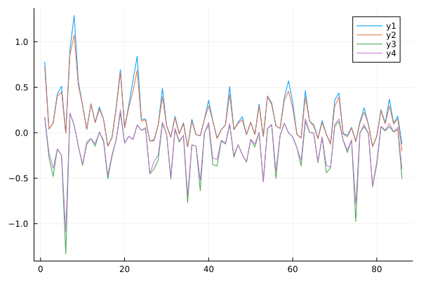
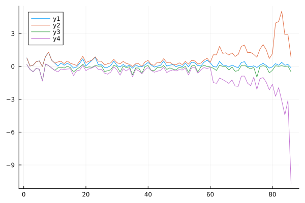
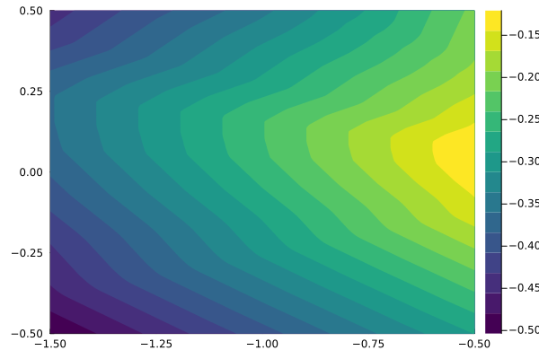
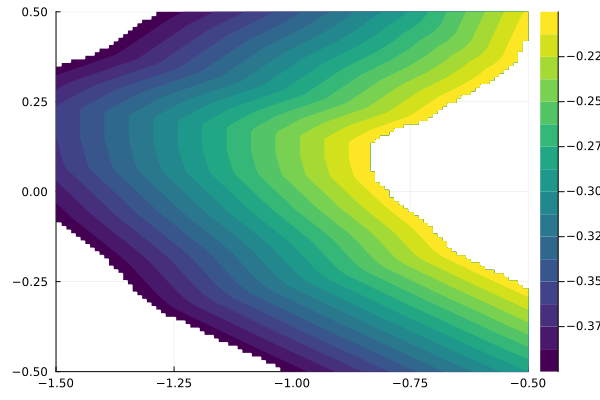

# Output bound considering tightening procedure

## Performance

### Output bounds considered
```julia
out_ub=[-0.2], out_lb=[-0.4]
```

`17.987260 seconds (407.83 k allocations: 14.170 MiB, 0.07% gc time)`

### Standard bound tightening
`1.199113 seconds (126.89 k allocations: 5.509 MiB)`

### Fast bound tightening (only bounds from the previous layer considered)

`0.003375 seconds (57.35 k allocations: 2.375 MiB)`

## Bounds


Bounds with output considered are slightly tighter than the normal bounds.



Fast bounds are considerably looser than the normal bounds, especially in deeper layers.

## JuMP model output


Neural network output in the input domain.



JuMP model output in the input domain. Note the missing regions that would have values outside of the output bounds.